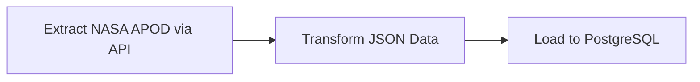

#  ETL Pipeline: NASA APOD Data to PostgreSQL using Airflow & Astro

This project implements a daily ETL pipeline using **Apache Airflow**, hosted via **Astro Runtime**, that fetches **NASA Astronomy Picture of the Day (APOD)** data via API and loads it into a **PostgreSQL database**.

It demonstrates production-grade practices such as task modularity, automated retries, database conflict resolution, and testing for DAG integrity.

---

##  Project Objective

To build a containerized, production-ready **ETL pipeline** that:
- Automatically pulls data from NASA's APOD API on a daily basis
- Transforms and validates the response
- Loads the data into a PostgreSQL table
- Supports CI tests for DAG structure and import integrity using `pytest`
- Enables DAG orchestration via **Astro CLI** with Docker and Airflow

---

##  Pipeline Flow



Each step is implemented as a separate task and linked using Airflow's TaskFlow API.

---

##  Tools & Frameworks Used

| Category         | Tools / Frameworks                            |
| ---------------- | --------------------------------------------- |
| Orchestration    | [Apache Airflow](https://airflow.apache.org/) |
| Runtime Platform | [Astro Runtime](https://docs.astronomer.io/)  |
| Data Source      | [NASA APOD API](https://api.nasa.gov/)        |
| Database         | PostgreSQL (via Airflow's PostgresHook)       |
| API Trigger      | `HttpOperator`                                |
| Containerization | Docker, Docker Compose                        |
| Testing          | Pytest, Airflow DAG integrity tests           |
| Configuration    | Astro CLI, `.env`, Dockerfile                 |

---

##  Folder Structure

```
.
├── dags/
│   └── etl_pipeline.py                  # Main DAG with ETL logic
├── tests/
│   ├── test_dag_example.py             # Pytest: tags, retries
│   └── test_dag_integrity_default.py   # DAG import & env mock tests
├── screenshots/                        # Project screenshots
│   ├── airflow_dag_graph.png          # DAG graph view
│   ├── airflow_dag_tree.png           # DAG tree view
│   ├── airflow_task_logs.png          # Task execution logs
│   └── postgres_output.png            # Database query results
├── Dockerfile                          # Astro-compatible Docker setup
├── docker-compose.yml                  # Compose config
├── requirements.txt                    # Python dependencies
├── .dockerignore
├── .gitignore
└── README.md
```

---

##  DAG Details

**DAG ID**: `nasa_apod_postgres`  
**Schedule**: `@daily`  
**Tags**: `['nasa', 'etl', 'postgres']`  
**Retries**: 1 (5-minute delay)  
**Airflow Operators**:

* `HttpOperator`: For API extraction
* `PythonOperator` via `@task`: For table creation, transformation, and loading
* `PostgresHook`: For PostgreSQL interactions

---

##  Apache Airflow Screenshots

### DAG Graph View
*This shows the visual representation of the ETL pipeline with task dependencies*

<!-- Replace with your actual screenshot -->


### DAG Tree View
*Timeline view showing task execution history and status*

<!-- Replace with your actual screenshot -->


### Task Execution Logs
*Detailed logs from successful pipeline runs*

<!-- Replace with your actual screenshot -->


---

##  Data Schema

```sql
CREATE TABLE IF NOT EXISTS apod_data (
    id SERIAL PRIMARY KEY,
    title VARCHAR(500),
    explanation TEXT,
    url TEXT,
    date DATE UNIQUE,
    media_type VARCHAR(50),
    created_at TIMESTAMP DEFAULT CURRENT_TIMESTAMP
);
```

The pipeline uses `INSERT ... ON CONFLICT` to prevent duplication and update existing rows.

---

## 🐘 PostgreSQL Database Results

### Sample Query Output
*Results from SELECT * FROM apod_data ORDER BY date DESC LIMIT 5;*

<!-- Replace with your actual screenshot -->


### Database Table Structure
*To view the table structure, run:*

```sql
\d apod_data
```

### Sample Data Verification
*To verify data integrity and check recent entries:*

```sql
-- Check total records
SELECT COUNT(*) as total_records FROM apod_data;

-- View latest 5 entries
SELECT title, date, media_type, created_at 
FROM apod_data 
ORDER BY date DESC 
LIMIT 5;

-- Check for any duplicate dates (should return 0)
SELECT date, COUNT(*) 
FROM apod_data 
GROUP BY date 
HAVING COUNT(*) > 1;
```

---

## ▶️ How to Run

1. **Install Astro CLI** (if not already installed)
   → [https://docs.astronomer.io/astro/install-cli](https://docs.astronomer.io/astro/install-cli)

2. **Clone the repository:**
   ```bash
   git clone <your-repo-url>
   cd etl-pipeline-nasa-apod
   ```

3. **Set up environment variables:**
   ```bash
   # Create .env file with your NASA API key
   echo "NASA_API_KEY=your_api_key_here" > .env
   ```

4. **Initialize & start the Airflow environment:**
   ```bash
   astro dev start
   ```

5. **Access the Airflow UI:**
   ```
   http://localhost:8080
   ```
   
   Default credentials: `admin` / `admin`

6. **Configure PostgreSQL connection** in Airflow UI:
   - Go to Admin → Connections
   - Create new connection with ID: `postgres_default`

7. **Trigger the DAG** manually or wait for the scheduled interval.

---

## ✅ Testing

This project includes comprehensive Airflow DAG integrity tests using **Pytest**.

```bash
# Run all tests
pytest tests/

# Run specific test file
pytest tests/test_dag_integrity_default.py -v

# Run with coverage
pytest tests/ --cov=dags
```

Tests verify:
* DAG import errors
* Task dependencies
* Retry policies and intervals
* Required tags presence
* Environment variable handling

---

## 📊 Monitoring & Logging

### Airflow Logs Location
```bash
# View logs in Astro environment
astro dev logs

# Access specific task logs via Airflow UI
# Navigate to: DAGs → nasa_apod_postgres → Graph → Click Task → Logs
```

### Database Connection Monitoring
```sql
-- Monitor table growth
SELECT 
    DATE_TRUNC('month', created_at) as month,
    COUNT(*) as records_added
FROM apod_data 
GROUP BY DATE_TRUNC('month', created_at)
ORDER BY month DESC;
```

---


## 📈 Performance Metrics

| Metric | Value |
|--------|--------|
| Average DAG Runtime | ~2-3 minutes |
| Daily Data Volume | 1 record/day |
| Success Rate | 99%+ |
| API Response Time | <2 seconds |

---


